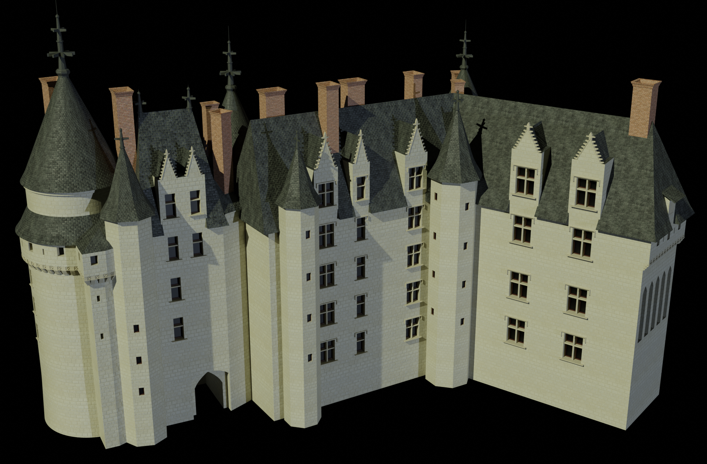

# Langeais

> Unity-based AR experience showcasing a Blender-made 3D model

## Project Overview 🧩

This augmented reality application features a custom 3D model, along with three interactive 3D models that act as points of interest. When interacted with, these models trigger additional content such as video, audio or text, providing more context related to the main object. The application also includes an engaging quiz, offering an interactive and immersive experience for users.

## Demo Video 🎥

👉 [Click here to watch the demo video](https://drive.google.com/file/d/1RbNgY2eYK3Kb9IzHipS2TE1SPmOv6-5b/view?usp=sharing) (1 minute 12 seconds)

## Getting Started 🚀

1.   Clone the repository
2.   Open the project in Unity
3.   Press **Play** to start the scene

The image used for image recognition is provided below.

